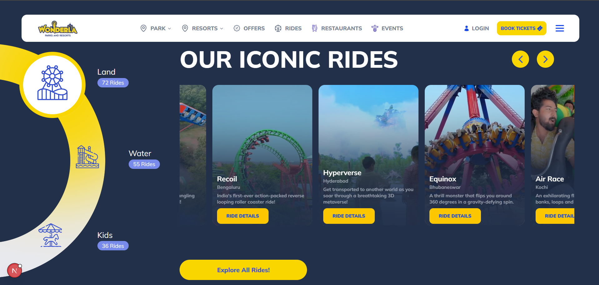

# 🎢 Wonderla Rides Section Clone

This project is a **frontend assignment** to replicate a section from the [Wonderla](https://www.wonderla.com) website, focusing on interactive ride carousels and category filtering. Built using **Next.js**, **Tailwind CSS**, and **Framer Motion**.

---

## 📸 Preview

> 
> Or link to your [Vercel Deployment](https://vercel.com)

---

## 🚀 Features

- Built using **Next.js** (React-based framework)
- Tailwind CSS for modern, utility-first styling
- Fully dynamic **ride carousel**
- **Auto-scroll**, **drag**, and **button navigation**
- Interactive **category switching** (Land, Water, Kids)
- Video background thumbnails with optimized loading
- Animations powered by **Framer Motion**
- Clean component architecture
- Fully local data (no API dependencies)

---

## 📂 Folder Structure

.
├── Components/
│ ├── RideCard.jsx
│ ├── CategorySidebar.jsx
│ ├── CarouselControls.jsx
│ ├── RidesSection.jsx
│ ├── Navbar1.jsx
│ └── SideBarChild.jsx
├── Data/
│ └── rides.js
├── public/
│ └── [All assets like images, icons]
├── pages/
│ └── index.jsx
└── styles/
└── [Tailwind configured globally]

---

## 🛠️ Tech Stack

- [Next.js](https://nextjs.org/) – Framework
- [Tailwind CSS](https://tailwindcss.com/) – Styling
- [Framer Motion](https://www.framer.com/motion/) – Animations
- [Lucide React Icons](https://lucide.dev/) – Icons
- Heroicons – UI icons for navigation

---

## 🧾 Assignment Instructions (Recap)

> Recreate the Wonderla Rides Section using:

- ✅ ReactJS or NextJS
- ✅ Tailwind CSS
- ✅ Proper component structure:
  - `RideCard`, `CarouselControls`, `CategorySidebar`, `RidesSection`
- ✅ Dynamic data loading from local JSON file
- ✅ Category filtering
- ✅ Carousel with scroll buttons
- ✅ "Explore All Rides" button
- ✅ Bonus: Auto-scroll + Framer Motion animations
- ❌ Mobile responsiveness not required

---

## 🧪 Local Setup

Follow the steps below to run the project locally:

```bash
# 1. Clone the repository
git clone https://github.com/YOUR_USERNAME/wonderla-rides-clone.git

# 2. Navigate into the project directory
cd wonderla-rides-clone

# 3. Install dependencies
npm install

# 4. Run the development server
npm run dev

# Open http://localhost:3000 to view it in the browser.
```

🌐 Deployment
Deployed on Vercel ✅
🔗 Live Preview: https://your-wonderla-clone.vercel.app/

📞 Contact
Name: Aayush Chaudhary
Email: aayushcyy@gmail.com

💡 Notes

- This is a frontend-only UI clone. No backend/API is used.

- Ride data was collected using DevTools from Wonderla’s original site.

- All videos/images are directly linked (CDN-hosted from Wonderla's site).

---

Would you like me to:

1. Customize it with your **GitHub repo link**, **Vercel link**, and **name**, or
2. Generate it as a downloadable `README.md` file?

Let me know!
